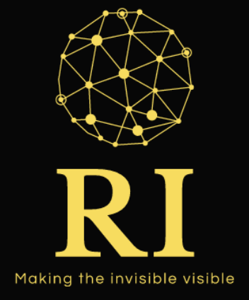

<!-- PROJECT LOGO -->

<p align="center">
    
</p>


## About the project 🚀

<p text-align: "justify"}
  
The Revealing Invisible project, part of the  HP Technology Observatory 2020-21, aims to magnify seemingly imperceptible changes in video sequences. The problem was approached using convolutional neural networks (CNNs), utilising high-level libraries such as [PyTorch](https://pytorch.org/) and [OpenCV](https://opencv.org/).

The proposal is based on the fact that the CNN is trained with two input images (original and slightly magnified original), to produce as output a magnified image (groundtruth). For this, we do not start from a set of training images and their respective validation set (magnified images), but these are generated dynamically (**synthetic production of the dataset**). In short, **image processing** comprises the following steps: make a copy of the original image, extract a random window from it, increase its size by a scale factor and paste the magnified window into the copy in a way that is centered with respect to the extraction position. This pasting will be done using the method of **alpha blending**, taking as a coefficient the value of the Gaussian. Therefore, the only differences between the slightly enlarged image (input) and the groundtruth image would be the scale factor and the value of the Gaussian at the edge.

Therefore, the proposed **neural network** must **learn** to **magnify** such **imperceptible changes** from the processing method explained previously. That is, it will be trained and validated with images, while when applied to videos, the video sequences will be divided into images (frames), passed through the network and joined together, to form the magnified video.
</p>

[](https://youtu.be/ZV32120yU7c)


<!-- GETTING STARTED -->
## Getting Started

This is an example of how you may give instructions on setting up your project locally.
To get a local copy up and running follow these simple example steps.

### Prerequisites

Download conda (https://www.anaconda.com/products/individual) and create and environment.
```python
conda create -n RevealingInvisible python=3.8
conda activate RevealingInvisible
```


### Installation

1. PyTorch | OpenCV | docopt | tqdm
```python
conda install pytorch torchvision torchaudio cudatoolkit=11.0 -c pytorch
conda install -c conda-forge opencv
conda install docopt
conda install tqdm

```
2. Clone the repo
   ```sh
   git clone https://github.com/saulcanortiz/RevealingInvisible.git
   ```
3. Install NPM packages
   ```sh
   npm install
   ```
4. Enter your API in `config.js`
   ```JS
   const API_KEY = 'ENTER YOUR API';
   ```


<!-- USAGE EXAMPLES -->
## Usage

Use this space to show useful examples of how a project can be used. Additional screenshots, code examples and demos work well in this space. You may also link to more resources.

_For more examples, please refer to the [Documentation](https://example.com)_


<!-- ROADMAP -->
## Roadmap

See the [open issues](https://github.com/othneildrew/Best-README-Template/issues) for a list of proposed features (and known issues).


<!-- CONTRIBUTING -->
## Contributing

Contributions are what make the open source community such an amazing place to be learn, inspire, and create. Any contributions you make are **greatly appreciated**.

1. Fork the Project
2. Create your Feature Branch (`git checkout -b feature/AmazingFeature`)
3. Commit your Changes (`git commit -m 'Add some AmazingFeature'`)
4. Push to the Branch (`git push origin feature/AmazingFeature`)
5. Open a Pull Request


<!-- LICENSE -->
## License

Distributed under the MIT License. See `LICENSE` for more information.


<!-- CONTACT -->
## Contact

Your Name - [@your_twitter](https://twitter.com/your_username) - email@example.com

Project Link: [https://github.com/your_username/repo_name](https://github.com/your_username/repo_name)


<!-- ACKNOWLEDGEMENTS -->
## Acknowledgements
* [GitHub Emoji Cheat Sheet](https://www.webpagefx.com/tools/emoji-cheat-sheet)
* [Img Shields](https://shields.io)
* [Choose an Open Source License](https://choosealicense.com)
* [GitHub Pages](https://pages.github.com)
* [Animate.css](https://daneden.github.io/animate.css)
* [Loaders.css](https://connoratherton.com/loaders)
* [Slick Carousel](https://kenwheeler.github.io/slick)
* [Smooth Scroll](https://github.com/cferdinandi/smooth-scroll)
* [Sticky Kit](http://leafo.net/sticky-kit)
* [JVectorMap](http://jvectormap.com)
* [Font Awesome](https://fontawesome.com)


<!-- MARKDOWN LINKS & IMAGES -->
<!-- https://www.markdownguide.org/basic-syntax/#reference-style-links -->
[contributors-shield]: https://img.shields.io/github/contributors/othneildrew/Best-README-Template.svg?style=for-the-badge
[contributors-url]: https://github.com/othneildrew/Best-README-Template/graphs/contributors
[forks-shield]: https://img.shields.io/github/forks/othneildrew/Best-README-Template.svg?style=for-the-badge
[forks-url]: https://github.com/othneildrew/Best-README-Template/network/members
[stars-shield]: https://img.shields.io/github/stars/othneildrew/Best-README-Template.svg?style=for-the-badge
[stars-url]: https://github.com/othneildrew/Best-README-Template/stargazers
[issues-shield]: https://img.shields.io/github/issues/othneildrew/Best-README-Template.svg?style=for-the-badge
[issues-url]: https://github.com/othneildrew/Best-README-Template/issues
[license-shield]: https://img.shields.io/github/license/othneildrew/Best-README-Template.svg?style=for-the-badge
[license-url]: https://github.com/othneildrew/Best-README-Template/blob/master/LICENSE.txt
[linkedin-shield]: https://img.shields.io/badge/-LinkedIn-black.svg?style=for-the-badge&logo=linkedin&colorB=555
[linkedin-url]: https://linkedin.com/in/othneildrew
[product-screenshot]: images/screenshot.png

