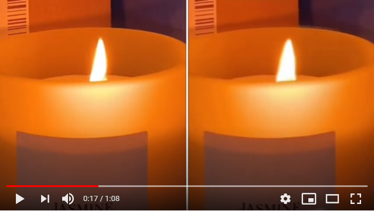

<!-- PROJECT LOGO -->

<p align="center">
    
</p>


## About the project 🚀

<p text-align: "justify"}
  
The Revealing Invisible project, part of the  HP Technology Observatory 2020-21, aims to magnify seemingly imperceptible changes in video sequences. The problem was approached using convolutional neural networks (CNNs), utilising high-level libraries such as [PyTorch](https://pytorch.org/) and [OpenCV](https://opencv.org/).

The proposal is based on the fact that the CNN is trained with two input images (original and slightly magnified original), to produce as output a magnified image (groundtruth). For this, we do not start from a set of training images and their respective validation set (magnified images), but these are generated dynamically (**synthetic production of the dataset**). In short, **image processing** comprises the following steps: make a copy of the original image, extract a random window from it, increase its size by a scale factor and paste the magnified window into the copy in a way that is centered with respect to the extraction position. This pasting will be done using the method of **alpha blending**, taking as a coefficient the value of the Gaussian. Therefore, the only differences between the slightly enlarged image (input) and the groundtruth image would be the scale factor and the value of the Gaussian at the edge.

Therefore, the proposed **neural network** must **learn** to **magnify** such **imperceptible changes** from the processing method explained previously. That is, it will be trained and validated with images, while when applied to videos, the video sequences will be divided into images (frames), passed through the network and joined together, to form the magnified video.
</p>

<[](https://youtu.be/ZV32120yU7c)>


<!-- GETTING STARTED -->
## Getting Started 🔧

This is an example of how you may give instructions on setting up your project locally.
To get a local copy up and running follow these simple example steps.

### Prerequisites

Download conda (https://www.anaconda.com/products/individual) and create and environment.
```python
conda create -n RevealingInvisible python=3.8
conda activate RevealingInvisible
```


### Installation

1. PyTorch | OpenCV | docopt | tqdm
```python
conda install pytorch torchvision torchaudio cudatoolkit=11.0 -c pytorch
conda install -c conda-forge opencv
conda install docopt
conda install tqdm
conda install glob

```
2. Clone the repo
   ```sh
   git clone https://github.com/saulcanortiz/RevealingInvisible.git
   ```


## Usage

There are 5 files whose main functions are:
* **Main.py** Command line interface
* **NetManager.py** Training, Validation and Test
* **NetDataset.py** Synthetic images generation
* **NetArchitecture.py** Convolutional Neural Network Architecture
* **parameters.py** Dataset parameters


<!-- ROADMAP -->
## Roadmap

### Training + Validation 

```python
python --train Main.py --in=train_images/ --gt=validation_images/ --inv=mtrain_images/ --gtv=validation_images/ --e=100
```

### Test
```python
python --test Main.py --ld=bestModel_validation.pt --in=test_images/ --out=magnified_images/
```

### Extra: Video Magnification
#### Video -> Frames
```python

img_array = []
for filename in glob.glob('ARENA_OUT/*.jpg'):
    img = cv2.imread(filename)
    img_array.append(img)
video = cv2.VideoCapture("IMG_3409.mp4")
success, image = video.read()
count = 100
while success:
    cv2.imwrite("ARENA_IN/frame%d.jpg" % count, image)
    success,image = video.read()
    print("Read a new frame: ", success)
    count += 1
````
#### Train + Validation + Test
#### Frames -> Video
```python
fourcc = cv2.VideoWriter_fourcc(*'mp4v')    
out=cv2.VideoWriter('arena.mp4', fourcc, 30, (720, 838)) 


for i in range(len(img_array)):
    out.write(img_array[i])
out.release()
```


<!-- CONTRIBUTING -->
## Tasks 📌

Have fun 😊


<!-- CONTACT -->
## Contact

Saúl Cano Ortiz - sc.ortiz1998@gmail.com

Project Link: [RevealingInvisible](https://hpscds.com/observatorio-hp/#RevealingInvisible)


